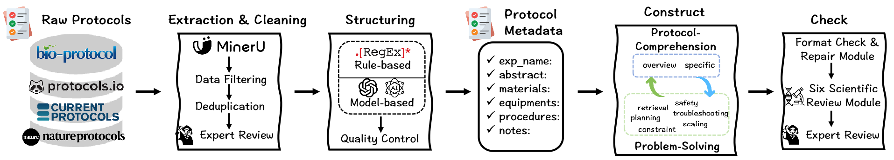
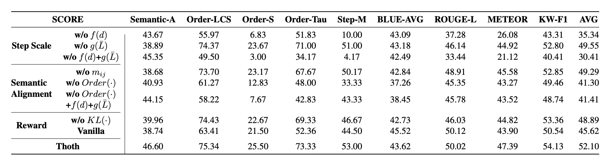

# 🧬 Thoth: Unleashing Scientific Reasoning for Bio-experimental Protocol Generation

<div align="center">

[](https://openreview.net/group?id=ICLR.cc/2026/Conference)
[](https://arxiv.org/abs/2510.15600)
[](./LICENSE)
[](https://www.python.org/downloads/)
[](https://thothshowcase-znvpduw8.manus.space/)

**A reproducible pathway for autonomous wet-lab protocol generation via structured component-based reward mechanism. 🌟If you find this project useful, please give us a star🌟.**

[🚀 Quick Start](#-quick-start) • 
[📊 Results](#-results) • 
[📦 Dataset](#-scirecipe-dataset) • 
[🔧 Training](#-training) • 
[📖 Citation](#-citation)


[🤗 Thoth](https://huggingface.co/manglu3935/Thoth) • [🤗 Thoth-mini](https://huggingface.co/manglu3935/Thoth-mini) • [🤗 SciRecipe](https://huggingface.co/datasets/manglu3935/SciRecipe) • [🌐 Website](https://thothshowcase-znvpduw8.manus.space/)

</div>

---

## 📖 Overview

**Thoth** is a knowledge-to-action model that transforms scientific knowledge into accurate, logically ordered, and executable biological experimental protocols. This repository introduces:

- **SciRecipe**: A comprehensive dataset of 12K+ expert-curated biological protocols across 27 subfields
- **Sketch-and-Fill Paradigm**: A novel reasoning framework that separates analysis, structuring, and execution
- **SCORE Mechanism**: A structured component-based reward system evaluating step granularity, order consistency, and semantic fidelity
- **Thoth Models**: State-of-the-art protocol generation models achieving SOTA performance on multiple scientific benchmarks

### 🎯 Key Achievements

| Metric | Thoth | vs ChatGPT-4o | vs DeepSeek-V3 |
|:------:|:-----:|:-------------:|:--------------:|
| **Average Performance** | **52.10** | +3.69 ↑ | +3.94 ↑ |
| **Semantic Alignment** | **46.60** | +6.56 ↑ | +4.88 ↑ |
| **Step Matching** | **53.00** | +9.00 ↑ | +11.29 ↑ |
| **Order Consistency** | **75.34** | +2.07 ↑ | +1.37 ↑ |


---

## 🚀 Quick Start

### Prerequisites

- Python 3.10+
- CUDA 12.1+ (for GPU acceleration)
- 17GB+ GPU memory (for Thoth-8B inference)
- 8GB+ GPU memory (for Thoth-mini-4B inference)

### Installation

```bash
# Clone the repository
git clone https://github.com/manglu097/Thoth.git
cd Thoth

# Install dependencies
pip install -r requirements.txt

# Install VERL framework (recommended for training)
cd verl
pip install -e .
cd ..
```

### Basic Inference

```bash
# Configure your model path and prompts in infer.py
export MODEL_PATH="path/to/thoth/model"

# Run inference
python infer.py
```

**Example Output:**
```
<think>
The original recipe uses 5 mL gel embedding premix as the base and adds 25 µL of 10% ammonium persulfate and 2.5 µL of TEMED. This corresponds to 5 mL premix + 0.005 mL (25 µL) ammonium persulfate + 0.0025 mL (2.5 µL) TEMED. The total ratio is therefore (25 µL : 5000 µL = 0.005%) of ammonium persulfate and (2.5 µL : 5000 µL = 0.05% TEMED) ...
</think>

<key>
Step 1: {"action": "measure", "objects": ["gel embedding premix"], "parameters": ["1 ml"]}
Step 2: {"action": "add", "objects": ["10% ammonium persulfate"], "parameters": ["5 µl"]}
...
</key>

<orc>
Step 1: Measure 1 ml of gel embedding premix.  
Step 2: Add 5 µl of 10% ammonium persulfate.  
...
</orc>

<note>
Ammonium persulfate is a strong oxidizer and TEMED is a flammable solvent; both must be handled with gloves and eye protection in a fume hood ...
</note>
```

---

## 📊 Results

### Main Results on SciRecipe-Eval

Our comprehensive evaluation across multiple metrics demonstrates Thoth's superior performance:

| Model | Semantic-A | Order-LCS | Order-S | Step-M | BLEU-AVG | ROUGE-L | METEOR | KW-F1 |
|:-----:|:----------:|:---------:|:-------:|:------:|:--------:|:-------:|:------:|:-----:|
| GPT-5 | 27.79 | 58.12 | 11.35 | 18.79 | 21.31 | 32.96 | 32.55 | 39.17 |
| ChatGPT-4o | 40.04 | 73.27 | 24.00 | 44.00 | 38.95 | 48.42 | 44.66 | 52.05 |
| Claude Opus 4.1 | 41.32 | 71.70 | 21.80 | 34.59 | 34.69 | 44.42 | 40.36 | 50.00 |
| DeepSeek-V3 | 41.72 | 73.97 | 21.44 | 41.71 | 38.18 | 48.49 | 45.08 | 52.33 |
| **Thoth-mini** | **44.28** | **74.68** | **25.33** | **52.67** | **43.32** | **49.23** | **46.41** | **53.13** |
| **Thoth** | **46.60** | **75.34** | **25.50** | **53.00** | **43.62** | **50.02** | **47.39** | **54.13** |


**Metric Definitions:**
- **Semantic-A**: Semantic alignment between generated and ground-truth protocols
- **Order-LCS**: Longest Common Subsequence of action sequences
- **Order-S**: Strict subsequence matching for action order
- **Step-M**: Step count matching with penalty for mismatches
- **BLEU-AVG, ROUGE-L, METEOR**: Standard NLP similarity metrics
- **KW-F1**: Keyword extraction F1 score

### Performance on Scientific Benchmarks

| Benchmark | Intern-S1 | SciDFM | **Thoth-mini** | **Thoth** |
|:---------:|:---------:|:------:|:--------------:|:---------:|
| HLE: Biomedicine | 9.52 | 15.01 | **16.33** | 15.65 |
| LAB-Bench: ProtocolQA | 42.59 | 16.20 | 37.96 | **43.52** |
| PubMedQA | 34.50 | 47.80 | 38.60 | **48.70** |
| **Average** | 28.87 | 26.34 | 30.96 | **35.96** |


---

## 📦 SciRecipe Dataset

### Dataset Overview



**SciRecipe** is a large-scale, multi-task dataset designed to improve and evaluate LLMs in experimental protocol understanding and generation.

- **Size**: 12,000+ expert-curated biological protocols
- **Coverage**: 27 biological subfields (neuroscience, molecular biology, cancer biology, etc.)
- **Sources**: Nature Protocols, Bio-protocol, Protocols.io, and expert curation
- **Quality**: Rigorous cleaning and structural validation

### Dataset Structure

```
data/
├── meta_data/          # SciRecipe metadata and construction scripts
│   ├── SciRecipe1.py   # Protocol-Comprehension Task
│   ├── SciRecipe2.py   # Problem-Solving Task
│   ├── prompt.py       # Prompt templates for SciRecipe1
    └── prompt2.py      # Prompt templates for SciRecipe2
├── mineru_pdf/         # Extracted protocol text (MinerU processed)
├── origin_pdf/         # Original experimental protocol PDFs
└── train_data/         # Processed SciRecipe training data
```

### Task Categories

#### 1. Protocol-Comprehension Tasks
- **Overview**: Global protocol summarization and high-level understanding
- **Specific**: Fine-grained analysis of protocol components and steps

#### 2. Problem-Solving Tasks
- **Retrieval**: Finding relevant protocols for given scientific queries
- **Planning**: Generating step-by-step experimental plans
- **Troubleshooting**: Identifying and resolving protocol issues
- **Constraint**: Handling experimental constraints and limitations
- **Scaling**: Adjusting protocol volumes and parameters
- **Safety**: Identifying safety considerations and hazards

### Data Access

**🤗 [Download SciRecipe Dataset](https://huggingface.co/datasets/manglu3935/SciRecipe)**

The complete SciRecipe dataset is now available on HuggingFace Hub:

```bash
# Access SciRecipe dataset
from datasets import load_dataset
dataset = load_dataset("manglu3935/SciRecipe")

# Explore the dataset
print(f"Dataset splits: {dataset.keys()}")
print(f"Training samples: {len(dataset['train'])}")
print(dataset['train'][0])
```

---

## 🔧 Training

### Sketch-and-Fill Paradigm

Thoth employs a three-stage reasoning paradigm that explicitly separates analysis, structuring, and execution:

```
Query: "Prepare gel embedding solution for a single brain slice"
         ↓
    <think> Stage
    Decompose objectives, identify dependencies, justify steps
         ↓
    <key> Stage
    Convert strategy to atomic, machine-readable steps (JSON format)
         ↓
    <orc> Stage
    Expand structured steps into fluent natural language
         ↓
    <note> Stage (Optional)
    Add critical safety information
```

### SCORE Mechanism

The **Structured COmponent-based REward** evaluates protocols across four dimensions:

#### 1. Format Gate
- Ensures output contains all four components: `<think>`, `<key>`, `<orc>`, `<note>`
- Validates JSON structure in `<key>` section
- Each step follows: `{"action": verb, "objects": [...], "parameters": [...]}`

#### 2. Consistency Gate
- Verifies step-by-step correspondence between `<key>` and `<orc>`
- Ensures semantic alignment across components
- Validates action-object-parameter relationships

#### 3. Step Scale Reward
- Measures gap between generated and ground-truth step counts
- Penalizes both under- and over-generation
- Formula: `f(d) = cos(π·d/2M)` where d is step count difference

#### 4. Step Semantics Reward
- **Order Consistency**: Evaluates action sequence alignment using LCS or strict subsequence matching
- **Semantic Consistency**: Measures object and parameter overlap for aligned steps
- Combined formula: `r_semantics = r_order · r_semantic`


### Training Configuration

```bash
# Edit run.sh to configure:
export TRAIN_DATA="path/to/train.parquet"
export TEST_DATA="path/to/test.parquet"
export MODEL_PATH="Qwen/Qwen3-8B"
export CKPT_DIR="./checkpoints/thoth_exp1"

# SCORE configuration
export GRPO_ORDER_MODE="strict_subseq"    # or "lcs"
export GRPO_COMBINE_MODE="sum"             # or "product"
export GRPO_CONTENT_DENOM="matched"        # or "max_len"
export GRPO_FINAL_COMBINE="product"        # or "sum"

# Start training
bash run.sh
```

---

## 📊 Evaluation

### Running Evaluations

```bash
# Configure evaluation parameters in eval/eval_batch.py
export MODEL_PATH="path/to/thoth/model"
export INPUT_JSONL="path/to/SciRecipe-Eval.jsonl"
export OUTPUT_JSONL="results/output.jsonl"
export NLTK_DATA_DIR="/path/to/nltk_data"
export BERTSCORE_MODEL="path/to/roberta-large"

# Run evaluation
python eval/eval_batch.py
```

### Evaluation Metrics

The evaluation suite includes:

1. **Executability Metrics** (left of dashed line in results table)
   - Semantic-A: Semantic alignment
   - Order-LCS: Longest common subsequence
   - Order-S: Strict subsequence matching
   - Step-M: Step count matching

2. **Lexical Similarity Metrics** (right of dashed line)
   - BLEU-AVG: BLEU score averaged across n-grams
   - ROUGE-L: ROUGE-L score
   - METEOR: METEOR score
   - KW-F1: Keyword extraction F1

---

## 🤖 Models

### Available Models

| Model | Base Model | Parameters | GPU Memory | Download |
|-------|-----------|-----------|-----------|----------|
| **Thoth-mini** | Qwen3-4B | 4B | 8GB | [🤗 HuggingFace](https://huggingface.co/manglu3935/Thoth-mini) |
| **Thoth** | Qwen3-8B | 8B | 17GB | [🤗 HuggingFace](https://huggingface.co/manglu3935/Thoth) |

### Model Performance Comparison

```
Thoth-mini (4B)
├─ Semantic-A: 44.28%
├─ Order-LCS: 74.68%
├─ Order-S: 25.33%
├─ Step-M: 52.67%
└─ Average: 51.10%

Thoth (8B)
├─ Semantic-A: 46.60%
├─ Order-LCS: 75.34%
├─ Order-S: 25.50%
├─ Step-M: 53.00%
└─ Average: 52.10%
```

---

## 🧪 Ablation Studies

### SCORE Component Ablation



### Sketch-and-Fill Impact

Adopting the Sketch-and-Fill paradigm provides consistent improvements:

| Model | BLEU-AVG ↑ | ROUGE-L ↑ | METEOR ↑ | KW-F1 ↑ |
|:-----:|:----------:|:---------:|:--------:|:-------:|
| DeepSeek-V3 | +4.82 | +4.28 | +3.79 | +2.69 |
| GPT-5 Chat | +3.20 | +0.94 | +3.92 | +3.63 |
| Qwen3-8B | −1.03 | −1.07 | −1.64 | +1.20 |
| **Thoth** | **+4.71** | **+3.58** | **+3.38** | **+3.50** |


---

## 📝 Citation

```bibtex
@article{sun2025unleashing,
  title={Unleashing Scientific Reasoning for Bio-experimental Protocol Generation via Structured Component-based Reward Mechanism},
  author={Sun, Haoran and Jiang, Yankai and Tang, Zhenyu and Pan, Yaning and Gu, Shuang and Lin, Zekai and Wang, Lilong and Lou, Wenjie and Liu, Lei and Bai, Lei and others},
  journal={arXiv preprint arXiv:2510.15600},
  year={2025}
}
```

---

## 🙏 Acknowledgments

We gratefully acknowledge:

- **[VERL](https://github.com/volcengine/verl)**: Providing the foundation for efficient RL training
- **[MinerU](https://github.com/opendatalab/MinerU)**: Enabling high-quality PDF text extraction
- **[Qwen](https://github.com/QwenLM/Qwen)**: Providing the base language models
- **Scientific Community**: For curating high-quality protocols and providing feedback

---

## 📞 Contact & Support

- **Issues**: Please report bugs and feature requests on [GitHub Issues](https://github.com/manglu097/Thoth/issues)
- **Email**: manglu3935@126.com

---

## 📄 License

This project is licensed under the MIT License - see the [LICENSE](./LICENSE) file for details.

---

## 🌟 Star History

If you find this project useful, please consider giving us a star! It helps us understand the community's interest and motivates further development.

[](https://www.star-history.com/#manglu097/Thoth&type=timeline&legend=bottom-right)

---

<div align="center">

**Made with ❤️ by the Thoth Team**

[⬆ back to top](#-thoth-unleashing-scientific-reasoning-for-bio-experimental-protocol-generation)

</div>