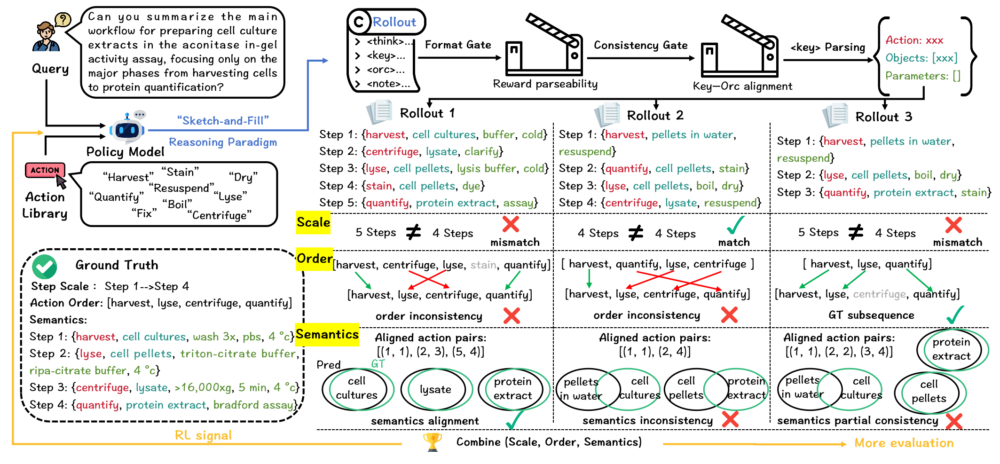
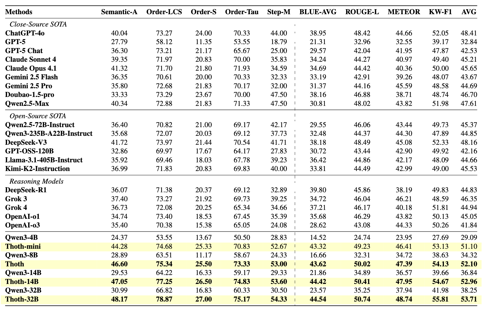
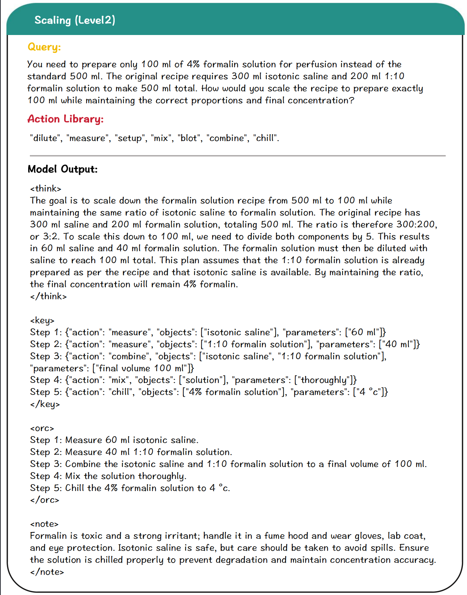

<div align="center">
<h1>  Unleashing Scientific Reasoning for Bio-experimental Protocol Generation via Structured Component-based Reward Mechanism </h1>
</div>

<h4 align="center"> If you find this project useful, please give us a star🌟.<h4 align="center"> 


## ⚡Introduction 



**SciRecipe & Thoth** introduce a reproducible pathway for autonomous wet-lab protocol generation.
We release SciRecipe, a dataset of 12K+ expert-curated biological protocols across 27 subfields, supporting both comprehension and problem-solving tasks.
To improve reliability, we propose a **Sketch-and-Fill** paradigm that explicitly separates analysis, structuring, and execution, paired with a component-based reward called **SCORE** to evaluate step granularity, order consistency, and semantic fidelity.
Based on these ideas, we develop Thoth, a staged Knowledge-to-Action model that learns to transform scientific knowledge into accurate, logically ordered, and executable protocols.

## 📚 SciRecipe


We introduce the **SciRecipe** dataset, designed to improve and evaluate LLMs in experimental protocol understanding and generation. SciRecipe comprises eight task types, grouped into two categories: Protocol-Comprehension Tasks (overview and specific), targeting global summarization and fine-grained analysis, and Problem-Solving Tasks (retrieval, planning, troubleshooting, constraint, scaling, and safety), simulating typical challenges encountered throughout experimental workflows.

```bash
# The repository only contains some demo data; the dataset and benchmark will be made public after the review process is complete.
data/
├── meta_data/   # Constructing SciRecipe metadata
├── mineru_pdf/  # Extracted protocol
├── origin_pdf/  # Original experimental protocols
└── train_data/  # SciRecipe
```

## 🏋️ Training
### Installation
```bash
# Please install verl from our repository. 
# This will help you better visualize the changing trends of each component in the reward during the training process.
cd verl 
pip install -e .
```
### Start !!!
For RL training, please specify the configuration in `./run.sh`, including the TRAIN_DATA and MODEL_PATH, as well as the configuration variables related to SCORE.
```bash
# You can customize and adjust the training parameters according to your hardware capabilities to avoid OOM.
bash ./run.sh
```

## 🤔 Model
| Model             | Base Model                                                   | Link                                                       | GPU Memory   | 
| ----------------- | ------------------------------------------------------------ | ---------------------------------------------------------- | ------------ |
| Thoth-mini     | [Qwen3-4B](https://huggingface.co/Qwen/Qwen3-4B) | [Wait]()      | 8GB |  
| Thoth   | [Qwen3-8B](https://huggingface.co/Qwen/Qwen3-8B) | [Wait]()   | 17GB |

We provide a simple inference script in `./infer.py`.

## 🧑‍⚖️ Evaluation 

You can use the script we provide in `./eval/eval_batch.py` to evaluate the Scirecipe-Eval benchmark (it may require slight modifications). Below are the specific instructions.

## 🏁 Results

Main results on SciRecipe-Eval. Metrics left of the dashed line evaluate executability, those on the right measure lexical similarity. Bold denotes the best score.

<div align=center>

</div>

<div align=center>

</div>

## 🐎 TODO
- Improve repository structure and documentation to enhance readability.
- Release **Thoth** model checkpoints on HuggingFace.
- Publish the **SciRecipe** dataset on HuggingFace.
- Address community feedback and resolve reported issues.


## 🙏🏼 Acknowledgement

We gratefully acknowledge the inspiring work of [VERL](https://github.com/volcengine/verl) and [MinerU](https://github.com/opendatalab/MinerU) which have provided essential foundations and inspiration for this project. We also thank the developers of these outstanding tools for their contributions to open-source innovation.

## 📖 Citation

```
Under Review ICLR 2026
```
