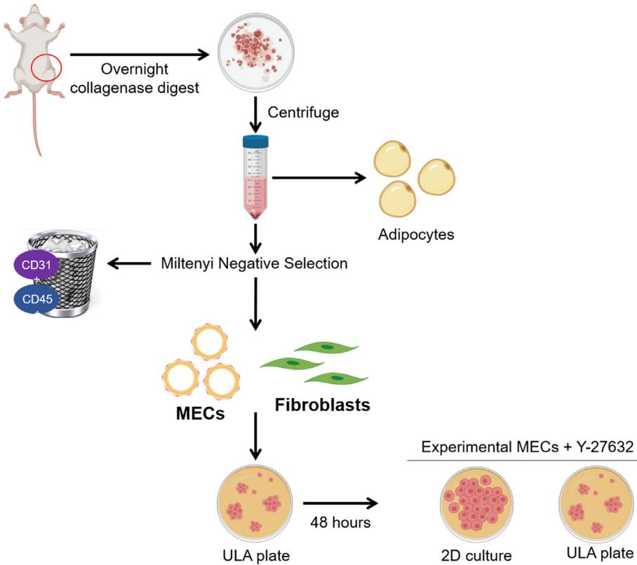
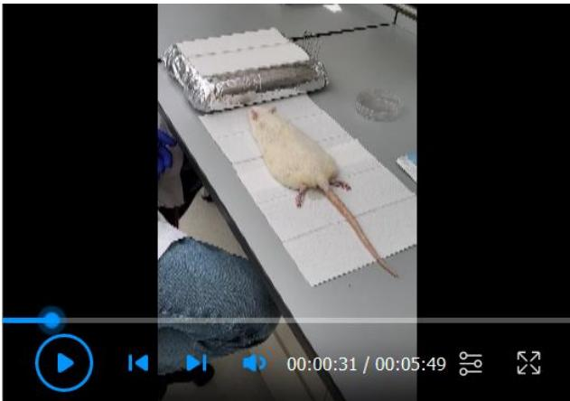
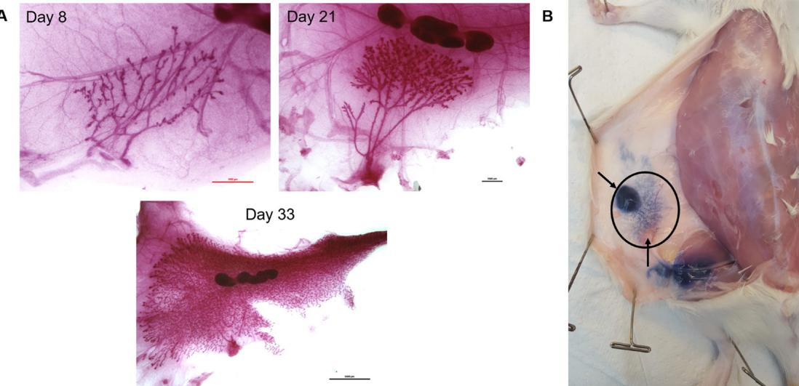
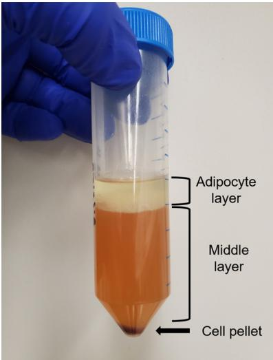
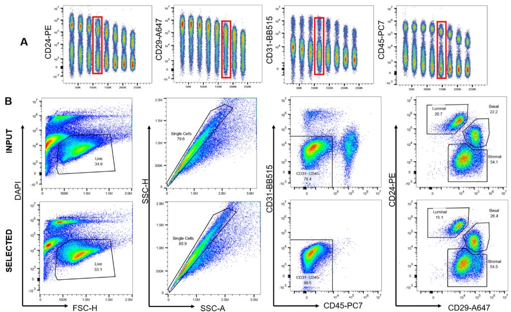
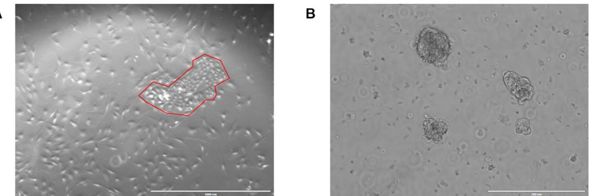
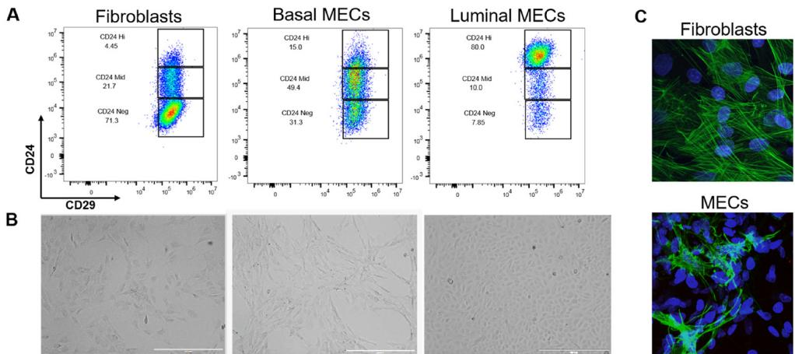

# Dissecting the Rat Mammary Gland: Isolation, Characterization, and Culture of Purified Mammary Epithelial Cells and Fibroblasts

Elizabeth A. Tovar1, \*, Rachael Sheridan2, Curt J. Essenburg1, Patrick S. Dischinger1, Menusha Arumugam1, Megan E. Callaghan1, Carrie R. Graveel1, # and Matthew R. Steensma1, 3, 4, #

1Center for Cancer and Cell Biology, Van Andel Research Institute, Grand Rapids, Michigan, USA; 2Flow Cytometry Core, Van Andel Research Institute, Grand Rapids, Michigan, USA; 3Helen Devos Children’s Hospital, Spectrum Health System, Grand Rapids, Michigan, USA; 4Michigan State University College of Human Medicine, Grand Rapids, Michigan, USA   
#Contributed equally to this work   
\*Corresponding author: elizabeth.tovar@vai.org

[Abstract] With the advent of CRISPR-Cas and the ability to easily modify the genome of diverse organisms, rat models are being increasingly developed to interrogate the genetic events underlying mammary development and tumorigenesis. Protocols for the isolation and characterization of mammary epithelial cell subpopulations have been thoroughly developed for mouse and human tissues, yet there is an increasing need for rat-specific protocols. To date, there are no standard protocols for isolating rat mammary epithelial subpopulations. Analyzing changes in the rat mammary hierarchy will help us elucidate the molecular events in breast cancer, the cells of origin for breast cancer subtypes, and the impact of the tumor microenvironment. Here we describe several methods developed for 1) rat mammary epithelial cell isolation; 2) rat mammary fibroblast isolation; 3) culturing rat mammary epithelial cells; and characterization of rat mammary cells by 4) flow cytometric analysis; and 5) immunofluorescence. Cells derived from this protocol can be used for many purposes, including RNAseq, drug studies, functional assays, gene/protein expression analyses, and image analysis.

Keywords: Rat, Mammary, Lineage, Mammary epithelial cells, Mammary gland dissociation, Fibroblasts

[Background] Most mammary-related research has been performed in mouse models and human samples. However, rat models of disease are becoming increasingly popular due to their human-like pharmacokinetic profile and mammary development (Russo et al., 1990; Jiunn et al., 2008; Smalley et al., 2016). Like human adenocarcinomas, rat mammary carcinomas go through stages of histological progression (Russo et al., 1990; Singh et al., 2000) and are ovarian hormone dependent (Thompson et al., 1998; Dischinger et al., 2018), making them ideal models for human breast cancer research. Mammary development can be divided into distinct stages: embryonic, pubertal, adult, pregnancy/lactation, and involution. In order to investigate specific mammary cell populations, it is necessary to separate the mix of epithelial (parenchymal) and stromal (mesenchymal) cell populations within the mammary gland. The gland is composed of luminal secretory alveolar and ductal cells, and basally positioned myoepithelial cells organized into ducts that drain milk from lobuloalveolar structures (Stingl et al., 2006; Shackleton et al., 2006; Sleeman et al., 2006; Asselin-Labat et al., 2006). The luminal layer contains ER-negative cells, which are mostly proliferative progenitors, and terminally differentiated ER-positive cells (Shehata et al., 2012). The basal layer consists of mammary stem cells and myoepithelial cells which function to mechanically contract alveolar cells to release milk droplets into the ductal lumen (Soady et al., 2015). Luminal and basal cells are presumed to come from a bipotent progenitor, derived from a mammary stem cell (Shackleton et al., 2006; Rios et al., 2014). This differentiation state-dependent lineage is termed the mammary epithelial hierarchy and the delineation of this hierarchy has vastly improved our understanding of the origins of breast cancer (Lim et al., 2009). To study the rat mammary epithelial hierarchy, we developed a method to isolate rat mammary epithelial cells (MEC) from the extensive stromal components within the mammary fat pad. Following MEC isolation, we used immunophenotyping, morphology, and immunofluorescence to verify the identity of the selected cells. Concurrently, we assembled a panel of antibodies directed toward wellcharacterized antigens to prospectively isolate mammary cell populations. The cellular composition of mouse and human mammary glands has been well-defined by multicolor flow cytometric analysis of cell surface proteins (Tornillo et al., 2015) by using highly optimized protocols (Smalley et al., 2012). Previously, a panel of rat-specific antibodies to mammary markers was used to characterize the adult rat mammary parenchyma (Dundas et al., 1991) while a different panel was used to quantify epithelial cell differentiation in adult carcinogen-treated rat mammary glands (Sharma et al., 2011). To our knowledge, no one has used flow cytometry to profile mammary development in rats using preconjugated, commercially available antibodies. In this protocol, we used antibodies targeted to hematopoietic (CD45+) and endothelial (CD31+) cells to exclude lineage positive populations in freshly isolated, monodispersed mammary populations (Shackleton et al., 2006). Then we used CD24 and CD29 to separate luminal (CD24hiCD29low) from basal/mammary stem cell enriched populations (CD24midCD29hi, Shackleton et al., 2006; Sleeman et al., 2006). By combining the methods above, we are able to isolate, characterize, and culture distinct rat mammary gland cell populations to study their contribution to breast cancer.

# Materials and Reagents

1. Sterile 100 mm tissue culture plate (Corning, catalog number: 430167)   
2. Eppendorf tubes   
3. 15- and 50-ml conical tubes (Greiner Bio-One, catalog numbers: 188271 and 227-261)   
4. 5- and 15-ml round bottom (BD Falcon, catalog numbers: 352063 and 352059)   
5. Glass Pasteur pipettes   
6. 40 μm cell strainer (Corning, catalog number: 149925)   
7. Fisherbrand Cover Glasses (Thermo Fisher Scientific, catalog number: 12-545F)   
8. 0.22 μm Steriflip filter (Millipore, catalog number: SCGP00525)   
9. CellTrics cell strainer (Sysmex, catalog number: 04-0042-2316)   
10. Ultra-low attachment plates, 6-well (Corning, catalog number: 3471)

Bio-protocol 10(22): e3818. DOI:10.21769/BioProtoc.3818

11. LS columns (Miltenyi, catalog number: 130-042-401)   
12. T25 tissue culture flask   
13. Sterile scalpels (Feather, catalog number: EF7281)   
14. Nunc Lab-Tek II Chamber Slide System (Thermo Fisher Scientific, catalog number: 154534)   
15. 8-40 days old Sprague-Dawley rats (Charles River Labs, catalog number: SAS Sprague  
Dawley® Rat (SD) | 400)   
16. 70% Ethanol   
17. HBSS (Gibco, catalog number: 14025-092)   
18. EpiCult B Basal Media and Proliferation Supplement (STEMCELL Technologies, catalog   
number: 05610)   
19. Fetal Bovine Serum (FBS) (VWR, catalog number: 1300-500)   
20. Penicillin-Streptomycin (10,000 U/ml) (Gibco, catalog number: 15140-122)   
21. Recombinant human epidermal growth factor (Sigma, catalog number: E9644)   
22. Human fibroblast growth factor (STEMCELL Technologies, catalog number: 78003.1)   
23. Heparin (STEMCELL Technologies, catalog number: 07980)   
24. Gentle collagenase/Hyaluronidase (STEMCELL Technologies, catalog number: 07919)   
25. Ammonium chloride (STEMCELL Technologies, catalog number: 07800)   
26. 0.05% Trypsin-EDTA (Gibco, catalog number: 25300-054)   
27. Dispase (STEMCELL Technologies, catalog number: 07913)   
28. DNase I (STEMCELL Technologies, catalog number: 07900)   
29. Dead Cell Removal Kit – includes dead cell removal microbeads and binding buffer (Miltenyi,   
catalog number: 130-090-101)   
30. Sterile double distilled water   
31. CD31-biotin (Miltenyi, catalog number: 130-105-935)   
32. CD45-biotin (Miltenyi, catalog number: 130-107-841)   
33. Anti-biotin microbeads (Miltenyi, catalog number: 120-000-927)   
34. DMEM/F12 media, no phenol red (Gibco, catalog number: 21041-025)   
35. Horse Serum (Gibco, catalog number: 16050-122)   
36. Hydrocortisone (Sigma, catalog number: H0888)   
37. Insulin (Sigma, catalog number: I6634)   
38. Cholera toxin (Sigma, catalog number: C8052)   
39. DAPI (Thermo, catalog number: 28718-90-3)   
40. Antibodies for flow analysis:   
CD31-BB515 (BD Biosciences, catalog number: 565408)   
CD45-PE-Cy7 (BD Biosciences, catalog number: 561588)   
CD29-AF647 (BD Biosciences, catalog number: 562153)   
CD24-PE (BD Biosciences, catalog number: 562104)   
41. Phosphate-buffered saline (PBS), pH 7.2 (Gibco, catalog number: 10010-023)   
42. Bovine serum albumin (BSA) (Sigma, catalog number: A7906)   
43. EDTA (Fisher Chemical, catalog number: E478-500)   
44. DMEM/F12 nutrient media (Gibco, catalog number: 11320033)   
45. 10 mg/ml Gentamicin (Thermo Fisher Scientific, catalog number: 15710064)   
46. Y-27632 (Tocris, catalog number: 1254)   
47. 0.25% trypsin (Thermo Fisher Scientific, catalog number: 25200-056)   
48. Rat skin collagen (we isolate this in-house, see below for reference) or use the following   
commercially available collagen – Collagen 1, rat tail (Gibco, catalog number: A10483-01)   
49. Glacial acetic acid (Sigma-Aldrich, catalog number: 695092)   
50. Formaldehyde (Sigma-Aldrich, catalog number: 252549)   
51. SMA-488 (Cell Signaling, catalog number: 34105)   
52. Tween-20 (Sigma-Aldrich, catalog number: P1379)   
53. Triton X-100 (Sigma-Aldrich, catalog number: X100)   
54. Methanol (Sigma-Aldrich, catalog number: 322415)   
55. Normal Goat serum (Cell Signaling, catalog number: 5425)   
56. ProLong Gold Antifade Mountant (Thermo Fisher Scientific, catalog number: P36930)   
57. Trypan blue (BioRad, catalog number: 1450021)   
58. Complete EpiCult B Medium (see Recipes)   
59. Selection buffer (see Recipes)   
60. HF Solution (see Recipes)   
61. MEC media (see Recipes)   
62. Fibroblast media (see Recipes)   
63. Antibody dilution buffer (see Recipes)   
64. Blocking buffer (see Recipes)   
65. 3.7% Formaldehyde (see Recipes)   
66. PBST wash buffer (see Recipes)

# Equipment

1. Pipettes   
2. Pipette aid   
3. Sterile scissors and forceps   
4. Centrifuge   
5. Humidified cell culture incubator (5% CO2, 37 °C)   
6. Vortex   
7. Miltenyi QuadroMACs magnet (Miltenyi, catalog number: 130-090-976)   
8. TC20 Automated Cell counter (Bio-Rad, model: 1450102)   
9. Biosafety cabinet for cell culture work   
10. CytoFLEXS (Beckman Coulter, model: C09766)   
11. EVOS FL Imaging System (Thermo Fischer Scientific, model: AMF4300)   
12. Nikon A1plus-RSi Laser Scanning confocal microscope (Nikon)   
13. Nikon oil immersion 60x Plan Apo VC with 1.4 NA (Nikon)   
14. Refrigerator

# Software

1. CytExpert v2.1 (Acquisition)   
2. FlowJo v10.6.2 (Analysis)   
3. Nikon Elements v5.11.00   
4. FIJI (imagej.nih.gov/ij/download)

# Procedure

The dissociation of mammary tissue and generation of single cell suspension protocols were adapted for use on rat tissue from the STEMCELL Technologies technical bulletin on the Monolayer Culture of Mouse Mammary Epithelial Cells. Additionally, the Miltenyi Dead Cell Removal and QuadroMACs cell selection protocols were adapted for use on rat mammary tissue to remove lineage positive rat hematopoietic (CD45+) and endothelial cells (CD31+) from mammary epithelial cells. The workflow of this protocol can be found in Figure 1.

  
Figure 1. Isolation of rat mammary epithelial cells and fibroblasts. The fourth mammary fat pads from female rats are removed and digested overnight. The following morning, adipocytes and

red blood cells are depleted by centrifugation and lysis, respectively. The remaining cells are subjected to negative selection using Miltenyi CD31 and CD45 biotin conjugated antibodies. Next, addition of Miltenyi anti-biotin microbeads allows capture of the antibody tagged lineage positive populations on an LS column with a Miltenyi QuadroMACS magnet. The eluted MECs and fibroblasts are cultured in ultra-low attachment (ULA) plates for 48 hours to deplete fibroblasts. Purified MECs are then maintained in ULA with the addition of Y-27632 or plated into 2D culture for experimental analysis. Figure 1 was created with BioRender.com.

A. Dissociation of rat mammary tissue

1. Euthanize the rat by CO2 asphyxiation according to your institutional IACUC protocol.   
2. Aseptically remove both fourth mammary fat pads from the rat, making sure to excise the entire ductal tree from the proximal nipple region out to the distal branches which may or may not have passed the lymph node, depending on the age. See Video 1 for rat mammary fat pad removal. Mammary development varies slightly among strains of rats. We exclusively use SpragueDawley rats purchased from Charles River Labs that are bred in-house at VARI (Figure 2). Refer to Filgo et al. (2016) for approximate mammary tree size at specific ages in Harlan SpragueDawley rats (Filgo et al., 2016) which is another commonly used rat strain. Keep in mind that the older the rat, the more developed the ductal tree and the more epithelial cells you will be able to isolate. Unfortunately, we observe decreased percent survival of digested cells from older rats compared to younger rats using this protocol (see Table 1). The decreased viability affects how many cells can be negatively selected. The fourth mammary fat pad is the largest and easiest fat pad to remove, but any fat pad may be substituted. Note that the first, second, fifth, and sixth fat pads are near muscle, and muscle contamination is not accounted for in our flow cytometry gating strategy.

  
Video 1. Aseptic removal of the 4th mammary fat pad from a wild-type Sprague Dawley rat

  
Figure 2. Rat mammary fat pad development and location. A. Representative carmine stained whole-mount images of the fourth mammary fat pad from female Charles Rivers Sprague-Dawley rats at postnatal days 8, 21, and 33 showing the mammary ductal tree, stroma, and lymph node. Images were taken at 4x (scale bar 1,000 µm), 2x (scale bar 1,000 µm), and 0.8x (scale bar 5,000 µm) respectively. B. Trypan blue dye was injected into the nipple of the fourth mammary fat pad following euthanasia of a 25-day old female rat to indicate the location and size of the fourth mammary fat pad (inside black oval). The top arrow points to the approximate location of the nipple where dye was injected. The bottom arrow points to an intramammary inguinal lymph node. At 25 days the ductal tree has reached the lymph node.

Table 1. Average yield and viability of cells following digestion and negative selection of ONE fourth mammary fat pad from a wild-type Charles River Sprague-Dawley female   

<table><tr><td>Postnatal Age (Days)</td><td>Average number of. cells digested (x 106)</td><td>Average viability after. dissociation (%)</td><td>Average number of negatively selected cells</td></tr><tr><td></td><td></td><td></td><td>(x 106)</td></tr><tr><td>8(n = 1)</td><td>3.0</td><td>72</td><td>---</td></tr><tr><td>20-30 (n = 20) 30-40 (n = 16)</td><td>16.7 33.0</td><td>56 44</td><td>4.4 (n = 7)</td></tr><tr><td>&gt; 40 (n = 26)</td><td>88</td><td>41</td><td>6.6 (n = 3)</td></tr><tr><td></td><td></td><td></td><td>2.9 (n = 7)</td></tr></table>

3. From here on, perform each step in a biological safety cabinet to maintain sample sterility. Be sure to spray everything with 70% ethanol and wipe down before placing in the biosafety cabinet.

4. Mince the fat pad with sterile scalpels in a sterile 100 mm plate in a crosswise pattern until glands are rendered into a paste.

5. Transfer the minced pad to a 50 ml conical tube.

6. Dilute 1-part 10x gentle collagenase/hyaluronidase mixture with 9 parts complete EpiCult B medium supplemented with 5% FBS into new 50 ml centrifuge tube. Add 10 ml per fat pad.

a. Fat pads from older rats have also higher adipocyte content; therefore, it is advisable to only digest one fat pad per one reaction (one reaction = 10 ml of complete EpiCult B + gentle collagenase/hyaluronidase). b. Two fat pads from a rat less than 30 days old can be combined into one reaction.   
7. Incubate mammary pads overnight, or 16 h, in a cell culture incubator – no rotating or shaking is required.   
8. The following day make up HF solution and put on ice.   
9. Vortex the digested samples for 10 s on high power.   
10. Centrifuge the cells at 350 x g for 5 min. There should be three layers in the conical tube: a pellet of cells at the bottom that contains stromal, epithelial, hematopoietic, and endothelial cells, a liquid middle, and an adipocyte layer at the top. See Figure 3.

  
Figure 3. Digested and centrifuged mammary fat pad. Representative image of the three layers present following centrifugation of a digested mammary fat pad.

11. Hold the tube at a 45° angle, use a glass Pasteur pipette, and carefully vacuum suction out the adipocyte and the liquid middle layers while avoiding the pellet. We recommend vacuuming the supernatant from the top down with the pipette to ensure as much of the fat as possible is removed. For this and subsequent steps, do not get too close to the pellet while vacuuming out the waste because the pellet is comprised of a heterogenous mix of cells and is not densely packed like tissue culture cell line would be.

12. Resuspend the pellet with 8 ml of a 1:4 mixture of cold HF and ammonium chloride (thaw ammonium chloride overnight at 2-8 °C).

13. Centrifuge the cells at 350 x g for 5 min and discard the supernatant.

B. Generation of a single cell suspension from dissociated rat mammary tissue 1. Add 4 ml of pre-warmed 0.05% Trypsin-EDTA to the digested mammary cells.

2. Gently pipette up and down for 1-3 min. The sample should become very stringy due to lysis of dead cells and the release of DNA.

3. Add 10 ml of cold HF and spin at 350 x g for 5 min.

4. Remove as much of the supernatant as possible and discard.

5. Add 2 ml of pre-warmed dispase (thaw overnight at 2-8 °C) and 200 μl of 1 mg/ml DNase I.

6. Pipette the sample for one minute to further dissociate cell clumps. The sample should now be cloudy.

7. Dilute the cell suspension with an additional 10 ml cold HF.

8. Filter the cell suspension through a 40 µm cell strainer into a new 50 ml centrifuge tube. Take an aliquot of cells to count.

9. Centrifuge at 350 x g for 5 min and discard the supernatant.

10. While the sample is centrifuging, count cells with trypan blue. Take the viable cell count to prepare cells for flow analysis OR take the total cell count to continue with dead cell removal and negative selection to isolate mammary epithelial cells for cell culture.

C. Dead cell removal

Note: It is important to remove dead cells using the Miltenyi dead cell removal kit before negative selection to improve selection efficiency and column binding. Dead cells can non-specifically bind the anti-biotin microbeads.

1. Prepare 1x binding buffer by dilution of 20x binding buffer stock solution: per 1 x 107 total cells, dilute 0.25 ml of 20x stock with 4.75 ml of sterile double distilled water.

2. Resuspend 1 x 107 total cells in 100 µl dead cell removal microbeads.

3. Mix well and incubate for 15 min at room temperature (RT).

4. Put an LS column in the QuadroMACS magnetic field.

5. Prepare the LS column by rinsing with 3 ml 1x binding buffer. One LS column can bind up to 1 x 108 dead cells and 2 x 109 total cells.

6. Adjust the cell suspension to 1 x 107 cells/ml with 1x binding buffer.

7. Pipette the cell suspension into the column and let the live cells flow through.

8. Rinse the column with 4 x 3 ml 1x binding buffer. Collect the effluent as the live cell fraction.

9. Spin down the sample at 300 x g for 10 min.

10. Proceed to negative selection.

D. Negative selection of CD24+/CD29+ cells

1. Adjust cell count to 1 x 106 cells/40 µl using selection buffer.

2. Label the cells with CD31 and CD45 biotinylated antibodies: 5 µl (0.15 µg) for every 1 x 106 cells for 10 min at 2-8 °C.

3. Wash cells with 2 ml of ice-cold selection buffer per 1 x 107 cells.

4. Centrifuge at 300 x g for 10 min.

5. Aspirate supernatant completely and discard.

6. Resuspend the pellet in 80 µl ice-cold selection buffer per 1 x 107 cells.

7. Add 20 µl of anti-biotin microbeads per 1 x 107 total cells.   
8. Mix well and incubate for 15 min at 2-8 °C.   
9. Wash cells with 2 ml of ice-cold selection buffer per 1 x 107 cells.   
10. Centrifuge at 300 x g for 10 min.   
11. Aspirate supernatant completely and discard.   
12. Resuspend up to 1 x 108 cells in 500 µl ice-cold selection buffer.   
13. Place a new LS column in the magnetic field of a QuadroMACS separator.   
14. Prepare the column by rinsing with 3 ml of buffer.   
15. Pipette the cell suspension onto the column and collect flow-through containing unlabeled cells–   
this elute will contain CD29+, CD24+, and stromal cells.   
16. Wash the column with 3 x 3 ml of buffer.   
17. Collect unlabeled cells that flow-through and combine with the effluent from Step D15.   
18. If the magnetically labeled CD45+ and CD31+ cells suspended in the column are required,   
pipette 5 ml of selection buffer onto the column and immediately flush out the cells by firmly   
pushing the plunger into the column.

# E. Generation of fibroblast cell lines

1. Immediately after negative selection, plate 0.5 ml of cell suspension into a T25 flask in 4 ml fibroblast media containing gentamicin. Gentamicin is toxic to primary epithelial cells and embryonic fibroblasts while post-natal derived fibroblasts are routinely grown in media containing the antibiotic (Alfonso et al., 1990; El Mouedden et al., 2000).

2. If the use of gentamicin is experimentally undesirable, you can also separate fibroblasts from epithelial cells by differential attachment (Smalley et al., 2012):

a. Plate 0.5 ml cell suspension and allow fibroblasts to adhere to the plate for 1 h.   
b. Aspirate and discard cell suspension solution, which will contain all non-attached cells.   
c. Wash the plate 1 x with enough media to cover the bottom of the plate.   
d. Aspirate and discard the media.   
e. Add 4 ml fibroblast media and allow fibroblasts to grow. Note that there may be epithelial contamination in your fibroblast culture with this method. Multiple rounds of the differential attachment procedure will help to purify the culture.

F. Generation and maintenance of MEC cell lines

1. To deplete fibroblasts, plate CD24+/CD29+ cells isolated from the negative selection in ultra-low attachment (ULA) plates in MEC media for 48 h. Fibroblasts will die by anoikis under these conditions. You can plate up to 2 million cells in one well of a 6-well ULA plate.   
2. After 48 h, check for living cells, which will be in macroscopically visible colonies. Single cells indicate failure of the cells to adapt to ULA conditions and are likely dead.

3. At this time, change media on the cells:

a. Pipette the spent media and cells into a 15 ml conical tube.   
b. Wash the ULA plate 1 x with PBS and add that to the cells from Step F3a.   
c. Centrifuge cells at 350 x g for 3 min.   
d. Aspirate the supernatant and discard.   
e. Resuspend the cells in MEC media + 10 µM Y-27632 in an ULA plate. Y-27632 is a ROCK inhibitor that prevents luminal cells from apoptosing by anoikis under low attachment conditions and prevents luminal cells from undergoing apoptosis before they can attach in 2D or 3D culture.   
f. We maintain the cells in ULA plates until ready to use in an experiment. Primary MECs in our hands only survive to passage 4 or 5, so plan timing of experiments carefully.

5. Change media every two days (except weekends).

6. When colonies range in size between 100-200 µm, they need to be split or the cells in the center of the colony will die.

7. To split colonies for maintenance or an experiment: a. Pipette spent media and cells into a 50 ml conical tube. b. Wash the ULA plate 1 x with PBS and add that to the cells from Step F7a. c. Centrifuge the cells at 350 x g for 3 min. d. Aspirate the supernatant and discard. e. Add 4 ml of 0.25% trypsin to the cell pellet. f. Pipette up and down 20 x. g. Add 10 ml of HF to neutralize the trypsin. h. Centrifuge the cells at 350 x g for 3 min. i. Aspirate the supernatant and discard. j. Add 2 ml dispase to the cell pellet. k. Pipette up and down 20 x. l. Add 10 ml of HF to neutralize the dispase. m. Centrifuge the cells at 350 x g for 3 min. n. Aspirate the supernatant and discard. o. Resuspend cells in growth media + 10 µM Y-27632. p. Plate in an ULA plate or on a collagen coated plate.

8. To separate luminal and basal cells grown on collagen coated plates, use differential trypsinization:

a. Wash the culture plate 1 x with PBS.   
b. Aspirate the PBS and discard.   
c. Add 0.05% trypsin-EDTA to the cells.   
d. After 5 min in trypsin, collect cells that have detached from the flask into a 50 ml conical tube.   
e. Wash plate 1 x with media containing FBS to neutralize the trypsin.   
f. Add the wash to the trypsinized cells. g. Add MEC media + 10 µM Y-27632 back to the plate. These are the strongly adherent luminal cells.   
h. Centrifuge the trypsinized cells at 350 x g for 3 min.   
i. Aspirate the supernatant and discard.   
j. Resuspend the cells in MEC media + 10 µM Y-27632.   
k. Plate the cells into a new collagen coated plate. These are the loosely adherent basal cells.

G. Collagen coating – thin coating procedure

Note: The protocol for isolating rat collagen was published by Pacak et al. in 2014. Note that the collagen obtained using the Pacak protocol is denatured. We have found that while rat MECs can attach to plastic tissue culture surfaces, they tend to peel off the plate in sheets with even the slightest disruption. Because mammary stroma is highly enriched in collagen, we coat our plates with a thin coat of rat skin collagen to which the cells can make much stronger attachments. MECs from our rats prefer rat skin collagen to commercially available rat tail collagen, although this can be used as a substitute. Tissue culture plates, chamber slides, glass coverslips, etc. can be coated with collagen. We mass coat many plates at one time and store them at 4 °C for 1 year. Protect both the collagen and collagen-coated plates from light.

1. Dilute the collagen to 50 µg/ml in sterile-filtered 20 mM acetic acid at the final volume needed.   
2. Pipette the collagen/acetic acid solution onto a tissue culture plate, dish, or flask using enough solution to cover the bottom surface.   
3. Gently rock the tissue culture vessel to make sure the entire surface where cells will grow is covered with the solution.   
4. Incubate in a biological safety cabinet at RT for 1 h protected from light.   
5. Aspirate the solution from the tissue culture vessel and discard. The aspirated waste should still be liquid, not solidified. The aspirated waste should be almost equal in volume to the input volume. A thin, invisible, coat of collagen will remain on the plastic surface of the tissue culture vessel.   
6. Wash the tissue culture vessel with an equal volume of 1x PBS 2-3 times to remove any traces of acetic acid. Discard all waste.   
7. Use the tissue culture vessel immediately or parafilm the edges and store at 4 °C for 1 year protected from light.

H. Flow cytometry analysis

1. Adjust cell count to 1 x 107 cells/ml using HF buffer + 0.01 mg/ml DNase I. 2. Aliquot 100 µl (1 x 106 cells) volumes into 15 ml round bottom polystyrene tubes. 3. Add the indicated microgram amount of antibody found in Table 2 to each sample – the amounts were determined by titrating each antibody for optimal signal to noise ratio.

It is highly recommended to use fluorescent minus one (FMO) controls to set gates and compensation controls to prevent spillover from all fluorescent channels in use for each experiment.

Table 2. Antibodies for flow cytometry   

<table><tr><td rowspan="2">Antibody</td><td rowspan="2">Fluorophore</td><td rowspan="2">Company</td><td rowspan="2">Catalog #</td><td rowspan="2">Ab Stock Concentration</td><td rowspan="2">g Ab/sample</td></tr><tr><td></td></tr><tr><td>CD31</td><td>BB515</td><td>BD</td><td>565408</td><td>0.2 mg/ml</td><td>0.125 g</td></tr><tr><td>CD45</td><td>PE-Cy7</td><td>BD</td><td>561588</td><td>0.2 mg/ml</td><td>0.0625 g</td></tr><tr><td>CD29</td><td>AF 647</td><td>BD</td><td>562153</td><td>0.2 mg/ml</td><td>0.03125 g</td></tr><tr><td>CD24</td><td>PE</td><td>BD</td><td>562104</td><td>0.2 mg/ml</td><td>0.125 g</td></tr></table>

4. Vortex 3 s.

5. Incubate for 30 min at RT.   
6. Add 3 ml HF (no DNase I) to the cell/antibody mix and centrifuge at 300 x g for 10 min.   
7. Decant supernatant and discard. There should be a visible cell pellet at the bottom of the tube.   
Do NOT aspirate out the supernatant.   
8. Vortex the cell pellet for 3 s.   
9. Add 300 µl HF + DAPI (10 mg/ml) to the cells and filter through a CellTrics cell strainer.   
10. Collect 30,000 single, live, CD31- , CD45- events on the CytoFLEXS and analyze using FlowJo.

I. Immunofluorescence

Note: The below procedure describes IF of cells in an eight well chamber slide, but it can be modified for cells attached to other surfaces including glass coverslips. The important thing to remember is to adjust volumes according to surface area. Cell density must be determined empirically as luminal cells are much smaller than basal cells or fibroblasts. Be very GENTLE when pipetting anything onto the cells because MECs detach easily, even when attached to collagen. Slowly add solution to wells by touching the pipette tip to the side wall of a chamber well.

1. Plate 2 x 104 cells into one well of an eight well chamber slide.   
a. Use a chamber slide coated with collagen for MECs.   
2. Allow the cells to attach overnight in a tissue culture incubator.   
3. Wash each well 3 x with 200 µl RT PBST. Discard washes.   
4. Fix with 4% formaldehyde (200 µl/well) at RT for 15 min.   
5. Pipette off the formaldehyde from the cells and put into a labeled waste container for proper   
disposal.   
6. Fix with ice cold methanol for 3 min (200 µl/well).   
7. Aspirate the methanol and discard.   
8. Add 200 µl/well blocking buffer.   
9. Incubate 1 h RT.

10. While the cells are incubating in blocking buffer, dilute the SMA-488 antibody 1:100 in antibody dilution buffer. Place the diluted antibody on ice and protect from light.

11. Aspirate the blocking buffer.   
12. Add 100 µl of diluted SMA-488 antibody to each well.   
13. Incubate for 2 h RT in the dark.   
14. Wash 3 x with 200 µl/well PBST. Discard washes.   
15. Add 200 µl/well DAPI, diluted 1:1,000 in antibody dilution buffer, RT for 10 min in the dark.   
16. Wash 3 x with 200 µl/well PBST. Discard washes.   
17. Gently remove the media chamber and glue off the slide.   
18. Pipette 100 µl of ProLong Gold mounting reagent onto the cells.   
19. Immediately place a glass coverslip onto the mounting media, making sure that all the cells are   
covered and that there are no air bubbles.   
20. Allow the mounting media to cure overnight at RT in the dark.   
21. Image the next day, if possible, using a fluorescent microscope. We use a laser scanning   
confocal microscope to acquire z-stacks which allows us to analyze the entirety of a sample.   
Furthermore, we use z-stacks to generate maximum intensity projection images in FIJI.   
22. Store the slides in a dark place. The fluorescent signal lasts 1-2 weeks if stored at 4 °C.

# Data analysis

1. We optimized a panel of commercially available, fluorophore-conjugated antibodies to verify the efficiency of negative selection for the purification of lineage negative rat mammary epithelial cells (Figure 4).

  
Figure 4. Antibody optimization and validation of negative selection. A. Each antibody was titrated from 1 to 0.003 µg to determine the amount required for optimal signal to noise ratio for

flow cytometry. B. Freshly digested fat pads were subjected to negative selection and the effectiveness of that selection analyzed with flow cytometry by comparing input, or non-selected cells, to selected cells. Single, live cells were gated on CD31 and CD45. After selection, 99.5% of cells were CD31- CD45- compared to 78.4% in the input.

2. Once negatively selected, purified MECs can be grown in culture on collagen coated plates or in ULA (Figure 5).

  
Figure 5. Rat MECs growing in culture. A. Rat MECs were plated onto collagen coated plates in MEC media + Y-27632. Note that by morphology, the presence of both luminal and basal cells can be verified. An island of luminal cells, outlined in red, is surrounded by myoepithelial basal cells. The brightfield image was acquired at 4x on the EVOS, scale bar 1,000 µm. B. Rat MECs were plated in ULA conditions in MEC media + Y-27632. The approximate size of the top colony is 100 µm and will need to be split before reaching 200 µm. The brightfield image was acquired at 10x on the EVOS, scale bar = 200 µm.

3. Following negative selection, basal and luminal cells were separated from each other for experimental purposes. The identity of these populations was validated by flow cytometry immunophenotyping, 2D morphology, and immunofluorescence (Figure 6).

  
Figure 6. Separation and validation of fibroblasts, luminal, and basal MECs. After 48 h in

ULA, MECs were plated onto collagen coated plates in MEC media + Y-27632. When the culture was 80% confluent, luminal and basal cells were separated by differential trypsinization and plated as purified populations. Fibroblasts were selected by differential attachment after negative selection but before culturing in ULA plates. A. Immunophenotyping of fibroblasts and MECs by expression of CD24 and CD29. While CD29 expression is constant across all three cell lines, fibroblasts are CD24neg, basal cells CD24mid, and luminal cells CD24hi. B. 2D morphology of fibroblasts compared to basal and luminal cells plated on collagen. Brightfield images were taken at 4x on the EVOS, scale bars = 1,000 µm. Note the mesenchymal appearance of basal cells and the tightly packed cuboidal appearance of luminal cells. C. We used immunofluorescence as a final verification that our epithelial cultures do not contain fibroblasts (and vice versa that our fibroblast cultures do not contain epithelial contamination) by staining rat fibroblasts and negatively-selected MECS (pooled luminal and basal cells) with an anti-smooth muscle actin antibody (green) and DAPI (nuclear stain, blue). Fibroblasts have distinct actin stress fiber formation whereas positive basal cells in the MEC culture present with membranous smooth muscle actin. Z-stacks were acquired at 60x on a Nikon A1plus-RSi Laser Scanning confocal microscope. Maximum intensity projection images were generated using FIJI.

# Notes

All helpful tips and tricks are contained within the protocol where applicable.

# Recipes

1. Complete EpiCult B Medium

a. Dilute 10x EpiCult B proliferation supplement to 1x in EpiCult B basal medium   
b. Once proliferation supplement is added, this media is stable at 2-8 °C for 1 month   
c. Add the following components immediately before use: 10 ng/ml recombinant human epidermal growth factor 10 ng/ml recombinant human basic fibroblast growth factor 4 µg/ml heparin d. Media is good for 1 week after addition of cytokines e. Freeze working aliquots of the EpiCult B proliferation supplement and stocks of each cytokine to avoid freeze thaws   
2. Selection buffer Phosphate-buffered saline (PBS), pH 7.2 0.5% bovine serum albumin (BSA) 2 mM EDTA Sterile filter using a 0.22 µm Steriflip filter Store at 4 °C for 6 months Miltenyi recommends de-gassing the selection buffer before each use, however we have not had any issues with air blocking the LS columns   
3. HF Solution HBSS supplemented with 2% FBS Store at 4 °C for 6 months   
4. MEC media DMEM/F12 media, phenol red free 10% horse serum 20 ng/ml EGF 0.5 µg/ml hydrocortisone 100 ng/ml cholera toxin 10 µg/ml insulin Media with supplements will be stable at 4 °C for 1-2 weeks This media was formulated for use on human breast cells (Debnath et al., 2003)   
5. Fibroblast media DMEM/F12, nutrient media 10% FBS 50 µg/ml Gentamicin Store at 4 °C for 1 month   
6. Antibody dilution buffer 1x PBS 1% BSA 0.3% Triton X-100 For 10 ml add 30 µl Triton X-100, 0.1 g BSA, and 1x PBS to 10 ml. Keep on ice. Make fresh before using and discard the remainder at the end of the experiment.   
7. Blocking buffer 1x PBS

5% normal goat serum

1% BSA   
0.3% Triton X-100   
For 10 ml add 0.5 ml normal goat serum, 30 µl Triton X-100, 0.1 g BSA, and 1x PBS to 10 ml   
Make fresh before using and discard the remainder at the end of the experiment

8. 3.7% Formaldehyde 10-fold dilution of 37% formaldehyde in 1x PBS Make fresh before using and dispose of in a formaldehyde waste container

9. PBST wash buffer 1x PBS 0.05% Tween-20 For 1 liter, add 500 µl of Tween-20 and mix well This buffer can be stored at RT indefinitely or until the buffer becomes turbid

# Acknowledgments

We would like to thank Bryn Eagleson and the VARI Vivarium staff for their expertise. Additionally, we would like to thank Corrine Esquibel, manager of the VARI Optical Imaging core for her help with microscopy and Cassandra Diegel of VARI for her expertise in mammary gland research. The protocols described here are used in multiple studies supported by the Breast Cancer Research Foundation, Muskegon Tempting Tables, Bee Brave Foundation, NF Michigan, and the Van Andel Foundation. This protocol was derived from: Dischinger et al. 2018. NF1 deficiency correlates with estrogen receptor signaling and diminished survival in breast cancer. NPJ Breast Cancer 4: 018- 0080.

# Competing interests

The authors declare they have no conflict of interest.

# Ethics

Use of animals in this protocol was approved by the Institutional Animal Care and Use Committee at Van Andel Research Institute under AUP #19-02-007.

# References

1. Alfonso, E.C., Albert, D.M., Kenyon, K.R., Robinson, N.L., Hanninen, L., DAmico, D.J. (1990). In vitro toxicity of gentamicin to corneal epithelial cells. Cornea 9(1): 55-61.   
2. Asselin-Labat, M.-L., Sutherland, K. D., Barker, H., Thomas, R., Shackleton, M., Forrest, N. C., Hartley, L., Robb, L., Grosveld, F. G., van der Wees, J., Lindeman, G. J. and Visvader, J. E.

www.bio-protocol.org/e3818

(2006). Gata-3 is an essential regulator of mammary-gland morphogenesis and luminal-cell differentiation. Nature Cell Biology 9: 201.   
3. Debnath, J., Muthuswamy, S. K. and Brugge, J. S. (2003). Morphogenesis and oncogenesis of MCF-10A mammary epithelial acini grown in three-dimensional basement membrane cultures. Methods 30(3): 256-268.   
4. Dischinger, P. S., Tovar, E. A., Essenburg, C. J., Madaj, Z. B., Gardner, E. E., Callaghan, M. E., Turner, A. N., Challa, A. K., Kempston, T., Eagleson, B., Kesterson, R. A., Bronson, R. T., Bowman, M. J., Graveel, C. R. and Steensma, M. R. (2018). NF1 deficiency correlates with estrogen receptor signaling and diminished survival in breast cancer. NPJ Breast Cancer 4(29): 018-0080.   
5. Dundas, S. R., Ormerod, M. G., Gusterson, B. A. and OHare, M. J. (1991). Characterization of luminal and basal cells flow-sorted from the adult rat mammary parenchyma. J Cell Sci 100(3): 459-471.   
6. El Mouedden, M., Laurent, G., Mingeot-Leclercq, M., Paul M. Tulkens, P.M. (2000). GentamicinInduced Apoptosis in Renal Cell Lines and Embryonic Rat Fibroblasts. Toxicol Sci 56(1): 229- 239.   
7. Filgo, A. J., Foley, J. F., Puvanesarajah, S., Borde, A. R., Midkiff, B. R., Reed, C. E., Chappell, V. A., Alexander, L. B., Borde, P. R., Troester, M. A., Bouknight, S. A. H. and Fenton, S. E. (2016). Mammary gland evaluation in juvenile toxicity studies: temporal developmental patterns in the male and female harlan sprague-dawley rat. Toxicol Pathol 44(7): 1034-1058.   
8. Jiunn, H. L. (2008). Applications and limitations of genetically modified mouse models in drug discovery and development. Curr Drug Metab 9(5): 419-438.   
9. Lim, E., Vaillant, F., Wu, D., Forrest, N. C., Pal, B., Hart, A. H., Asselin-Labat, M.-L., Gyorki, D. E., Ward, T., Partanen, A., Feleppa, F., Huschtscha, L. I., Thorne, H. J., kConFab, Fox, S. B., Yan, M., French, J. D., Brown, M. A., Smyth, G. K., Visvader, J. E. and Lindeman, G. J. (2009). Aberrant luminal progenitors as the candidate target population for basal tumor development in BRCA1 mutation carriers. Nat Med 15(8): 907-913.   
10. Pacak, C. A., MacKay, A. A. and Cowan, D. B. (2014). An improved method for the preparation of type I collagen from skin. J Vis Exp(83): e51011.   
11. Rios, A. C., Fu, N. Y., Lindeman, G. J. and Visvader, J. E. (2014). In situ identification of bipotent stem cells in the mammary gland. Nature 506: 322.   
12. Russo, A., Gusterson, B., Rogers, A., Russo, I., Wellings, S. and van Swieten, M. (1990). Compartive study of human and rat mammary tumorigenesis. Lab Invest 62(3): 244-278.   
13. Shackleton, M., Vaillant, F., Simpson, K. J., Stingl, J., Smyth, G. K., Asselin-Labat, M. L., Wu, L., Lindeman, G. J. and Visvader, J. E. (2006). Generation of a functional mammary gland from a single stem cell. Nature 439: 84.   
14. Sharma, D., Smits, B. M. G., Eichelberg, M. R., Meilahn, A. L., Muelbl, M. J., Haag, J. D. and Gould, M. N. (2011). Quantification of epithelial cell differentiation in mammary glands and carcinomas from dmba- and mnu-exposed rats. PLOS ONE 6(10): e26145.   
15. Shehata, M., Teschendorff, A., Sharp, G., Novcic, N., Russell, I. A., Avril, S., Prater, M., Eirew, P., Caldas, C., Watson, C. J. and Stingl, J. (2012). Phenotypic and functional characterisation of the luminal cell hierarchy of the mammary gland. Breast Cancer Res 14(5): R134.   
16. Singh, M., McGinley, J. and Thompson, H. (2000). A comparison of the histopathology of premalignant and malignant mammary gland lesions induced in sexually immature rats with those occuring in human. Lab Invest 80: 221-231.   
17. Sleeman, K. E., Kendrick, H., Ashworth, A., Isacke, C. M. and Smalley, M. J. (2006). CD24 staining of mouse mammary gland cells defines luminal epithelial, myoepithelial/basal and nonepithelial cells. Breast Cancer Res 8(1): R7-R7.   
18. Smalley, E. (2016). CRISPR mouse model boom, rat model renaissance. Nat Biotechnol 34(9): 893-894.   
19. Smalley, M. J., Kendrick, H., Sheridan, J. M., Regan, J. L., Prater, M. D., Lindeman, G. J., Watson, C. J., Visvader, J. E. and Stingl, J. (2012). Isolation of mouse mammary epithelial subpopulations: a comparison of leading methods. J Mammary Gland Biol Neoplasia 17(2): 91- 97.   
20. Soady, K. J., Kendrick, H., Gao, Q., Tutt, A., Zvelebil, M., Ordonez, L. D., Quist, J., Tan, D. W.- M., Isacke, C. M., Grigoriadis, A. and Smalley, M. J. (2015). Mouse mammary stem cells express prognostic markers for triple-negative breast cancer. Breast Cancer Res 17(1): 31.   
21. Stingl, J., Eirew, P., Ricketson, I., Shackleton, M., Vaillant, F., Choi, D., Li, H. I. and Eaves, C. J. (2006). Purification and unique properties of mammary epithelial stem cells. Nature 439: 993.   
22. Thompson, H. J., McGinley, J., Rothhammer, K. and Singh, M. (1998). Ovarian hormone dependence of pre-malignant and malignant mammary gland lesions induced in pre-pubertal rats by 1-methyl-1-nitrosourea. Carcinogenesis 19(3): 383-386.   
23. Tornillo, G. and Smalley, M. J. (2015). ERrrr…Where are the Progenitors? Hormone Receptors and Mammary Cell Heterogeneity. J Mammary Gland Biol Neoplasia 20(1-2): 63-73.