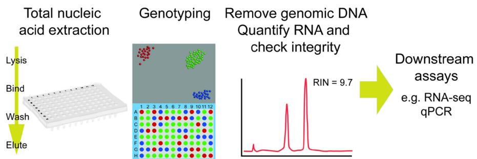
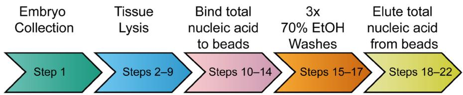

# Total Nucleic Acid Extraction from Single Zebrafish Embryos for Genotyping and RNA-seq

Neha Wali1, \$, Munise Merteroglu2, Richard J. White1, 2 and Elisabeth M. Busch-Nentwich1, 2, \*

1Wellcome Sanger Institute, Cambridge, United Kingdom   
2Cambridge Institute of Therapeutic Immunology & Infectious Disease, Department of Medicine,   
University of Cambridge, Cambridge, United Kingdom   
\$Current address: DNA Pipelines, Scientifc Operations, Wellcome Sanger Institute, Cambridge, United   
Kingdom   
\*For correspondence: e.busch-nentwich@qmul.ac.uk

[Abstract] RNA sequencing allows for the quantification of the transcriptome of embryos to investigate transcriptional responses to various perturbations (e.g., mutations, infections, drug treatments). Previous protocols either lack the option to genotype individual samples, or are laborious and therefore difficult to do at a large scale. We have developed a protocol to extract total nucleic acid from individual zebrafish embryos. Individual embryos are lysed in 96-well plates and nucleic acid is extracted using SPRI beads. The total nucleic acid can be genotyped and then DNase I treated to produce RNA samples for sequencing. This protocol allows for processing large numbers of individual samples, with the ability to genotype each sample, which makes it possible to undertake transcriptomic analysis on mutants at timepoints before the phenotype is visible.

# Graphic abstract:

# Extraction of total nucleic acid from individual zebrafish embryos for genotyping and RNA-seq.

Keywords: RNA-seq, Zebrafish, Transcriptomics, Genotyping [Background] RNA-sequencing (RNA-seq) is used to probe the transcriptome of samples. It can quantify the transcript abundances of different RNAs, as well as provide information on transcript structure such as alternatively spliced isoforms. The technique is widely used in developmental biology to uncover genes that are differentially expressed between two conditions such as mutant and wild-type siblings. Originally, pooled samples of multiple embryos were used to ensure a sufficient yield for the library-making protocols. De Jong et al. (2010) developed a phenol/chloroform-based method to extract RNA from individual zebrafish. Dupret et al. (2018) modified this protocol to also allow for genotyping of the individual samples. This involves removing a section of the larval tail and using this for genotyping, while the anterior part of the embryo is used for preparation of RNA. This is only possible at certain stages, and could potentially induce injury-dependent changes in gene expression. In addition, this procedure is labour-intensive and time-consuming, making it difficult to scale up.

We have developed this protocol to enable us to do large-scale transcriptomics on individual zebrafish embryos (White et al., 2017). We extract total nucleic acid and use this for genotyping. The sample is then DNase I treated to remove the genomic DNA, leaving RNA for the RNA-sequencing library making protocol. This allows for genotyping of individual embryos, which facilitates applying transcriptomic analysis to mutant lines at stages of development before a morphological phenotype is evident (Dooley et al., 2019). This is often crucial to identifying early transcript changes, as by the time a phenotype is visible, differentially expressed transcripts can number in their hundreds or thousands, due to downstream regulatory consequences of the initial perturbation. Therefore, tracking down the immediate changes in response to a mutation is hugely helpful in pinpointing the specific processes involved in the phenotype.

RNA-seq on individual embryos rather than pools of embryos allows for a more accurate assessment of inter-individual variation. This protocol means that we can analyse large numbers of replicates per condition (10-12 individuals), providing much better statistical power. This has allowed us to pick up changes in specific tissues in whole embryos, without the need for purifying specific cell populations by FACS analysis. This protocol produces high quality RNA suitable for RNA-seq or quantitative RT-PCR.

# Materials and Reagents

Nucleic Acid extraction   
1. Zebrafish embryos   
2. Round bottom assay blocks (Axygen, catalog number: P-DW-20-C-S)   
3. Adhesive plate seals (Thermo Fisher Scientific, catalog number: AB0558)   
4. 5 mm stainless steel beads (Qiagen, catalog number: 69989)   
5. Optional: TissueLyser Single-Bead Dispenser, 5 mm (Qiagen, catalog number: 69965)   
6. Plate seal roller (Bio-Rad Laboratories, catalog number: MSR0001)   
7. Adhesive PCR plate foils (Thermo Fisher Scientific, catalog number: AB0626) or PlateLoc heat   
seal (Agilent, catalog number: 24210-001), if using heat sealer   
8. 96-well V bottom 0.3 mL plate (Thermo Fisher Scientific, catalog number: AB1400L)   
9. 96-well superplate (Thermo Fisher Scientific, catalog number: AB-2800)   
10. RnaseZap Rnase Decontamination Solution/Wipes (Thermo Fisher Scientific, catalog number:   
AM9782/AM9786)   
11. Agencourt RNAClean XP beads (Beckmann Coulter, catalog number: A63987)   
12. Optional: AMPure XP Beads (Beckman Coulter, catalog number: A63881) are a cheaper

alternative to RNA clean XP beads and work equally well in our hands. They are not guaranteed Rnase-free, however.

13. Egg water (Westerfield, 2007)

14. RLT buffer (Qiagen, catalog number: 79216)   
15. Optional: RLT Plus buffer (Qiagen, catalog number: 1053393). This can be used in place of RLT   
buffer. However, it requires the addition of Reagent Dx (below)   
16. Optional: Reagent Dx (Qiagen, catalog number: 19088). Add to RLT Plus buffer at 0.5% v/v.   
17. β-mercaptoethanol (Sigma-Aldrich, catalog number: M3148-100ML)   
18. Ethanol (≥99.8% Sigma-Aldrich, catalog number: 51976-500ML-F)   
19. Rnase-free water (DEPC-Treated Water; Invitrogen, catalog number: AM9916)

# B. Genotyping

1. 96-well KASP plate (Thermo Scientific, catalog number: AB-0800/K) 2. KASP-TF V4.0 2× Master Mix (KBS-1050-102) 3. KASP reaction master mix (see Recipes)   
C. DNase I treatment 1. DNase I (New England Biolabs, catalog number: M0303L) 2. 10× DNase I buffer (Thermo Scientific, catalog number: AM8170G) 3. 0.5 M EDTA (Sigma, catalog number: E7889)   
D. RNA quantification 1. Quant-iTTM RNA Assay Kit (Invitrogen, catalog number: Q33140) 2. Bioanalyzer RNA 6000 Pico Kit (Agilent, catalog number: 5067-1513)

# Equipment

A. Nucleic Acid extraction 1. Multichannel pipette (e.g., Rainin, Pipet-Lite XLS, L200) 2. Plate Sealer (Agilent Technologies, PlateLoc) if using heat seals 3. TissueLyser II (Qiagen, Brand, catalog number: 85300) 4. TissueLyser Plate Adaptor Set (Qiagen, catalog number: 11990) 5. Magnet (DynaMagTM-96 Side Skirted Magnet; Thermo Fisher Scientific, catalog number: 12027)

# B. Genotyping

1. Fluorescence Plate Reader Note: For genotyping, we use a BMG LABTECH PHERAstar, but any FRET-capable plate reader will work. It is also possible to use a qPCR machine. See https://www.biosearchtech.com/support/education/kasp-genotyping-reagents/running-kasp

genotyping-reactions. 2. Thermocycler 3. Repeater pipette (e.g., multipette M4; Eppendorf, catalog number: 4982000012) 4. Tips for repeater pipette (e.g., 0.2 mL Combitips; Eppendorf, catalog number: 0030089413)   
C. DNase I treatment 1. Thermocycler   
D. RNA quantification 1. Fluorescence plate reader 2. Bioanalyzer (Agilent)

# Software

1. KlusterCaller (LGC, https://www.biosearchtech.com/support/tools/genotypingsoftware/klustercaller)

# Procedure

A. Nucleic acid extraction Individual embryos are collected into 96-well blocks. Embryos are lysed and total nucleic acid is bound to paramagnetic beads (SPRI). After washing, the nucleic acid is eluted from the beads using water (Figure 1).

  
Figure 1. Schematic of the extraction workflow.

An overview of the different parts of the extraction procedure. The steps for each part are shown inside the coloured arrows.

Note: A clean working environment is essential. Use clean gloves and spray the bench, equipment, and gloves with RnaseZap, to avoid Rnase contamination.

1. Collect single embryos in each well of a 2 mL round bottom assay block. Collect the embryos in 9 μL of egg water using truncated pipette tips. Pre-chill the plate on dry ice, and lower the pipette tip to the bottom of each well, to freeze the embryo instantly. Label the plate on the front and side with the well numbers that contain collected embryos and the experiment name. Seal the plate using adhesive plate seals. Pull the seal on the sides and secure the plate. Do not pull them over the labelled side as the ink may come off when the seal is removed. Immediately place on dry ice for \~5 min. From this step, you can either proceed to extraction straight away or store the plate at -80°C until needed.

# On the day of extraction

2. Remove Agencourt RNAClean XP/AMPure XP beads from the fridge to come to room temperature over 30 min. Shake well to resuspend beads.

3. Prepare 70% ethanol fresh. You will need \~700 μL per well.

# Under the fume hood

4. Prepare lysis buffer as below:

RLT buffer (as needed, stored at RT) + 10 μL of 14.3 M β-mercaptoethanol for every 1 mL of RLT buffer. For single embryo extractions, 110 μL of RLT buffer/well is enough to sufficiently lyse the tissue. Make a pre-mix in a 5 mL tube for up to 24 samples, or multi-channel dispensing dish. Dispose of solid and liquid waste containing β-mercaptoethanol according to institutional guidelines. If you are using RLT plus buffer, add 0.5% v/v of Reagent Dx. Buffer RLT plus contains detergent which foams on agitation. Reagent Dx is an antifoaming reagent and prevents loss of material as foam.   
5. Take the embryo plate out of -80°C and place on dry ice. While still on dry ice, add 110 μL of RLT buffer containing β-mercaptoethanol to the wells using a multichannel pipette.   
6. Add one 5 mm stainless steel bead in each well of the plate containing the embryos with clean gloved hands. Note: Clean gloves with RNaseZap, to avoid RNase contamination. Using a TissueLyser SingleBead Dispenser (see Materials and Reagents) is an alternative.   
7. Remove the plate from the dry ice and allow time to defrost. Dry the top of the plate with a clean tissue and seal using adhesive foil plate seals. Do not push the seal inside the wells, as this will make it more likely that the bead will pierce the seal in the TissueLyser. Alternatively, if using a heat sealer, seal the plate 6 times using a heat seal at 170°C for 3 s. Wait a few seconds between seals and secure the sides by using a plate seal roller. The extra layers of seals ensure that the bead does not pierce the seal during agitation.

Notes:

a. Sealing the plate properly before using the TissueLyser is imperative to avoid the steel bead piercing the seal and causing sample loss and cross contamination. If using a heat sealer, we use 6 layers of seals.   
b. If using adhesive foil seals, allow some time at room temperature after adding the RLTbuffer before sealing to give time for the plate to defrost. The top of the plate should be dried with a tissue, so the seal sticks on the plate and doesn’t come off. Do not press the film into the wells. This will make the bead more likely to pierce the seal. One side of the TissueLyser adapter is completely flat and the other side is not. Make sure that the flat side of the adapter is on top of the plate and that the adapter is tight. We recommend testing the integrity of your plate seals on a plate containing water before processing real samples.   
8. Install Plate Adaptor Set onto TissueLyser II, according to manufacturer's instructions. Arrange 2 mL assay blocks on the adaptor. Make sure the adaptor is balanced, that the plates are aligned properly between the adaptors, and the adaptor is not at an angle. Run protocol at 12 Hz frequency for 5 min at room temperature.   
9. When the Tissue Lyser program ends, briefly spin the sample plate to collect the lysate at the bottom of the plate. If the lysate does not appear homogeneous, rerun the program at 12 Hz at two minutes increments until the lysate appears homogenous. Note: The following steps need to be done under the fume hood.   
10. While the sample is lysing, add 1.8× volumes (180 μL) AgenCourt RNAClean XP beads to the appropriate wells of a clean V bottom 0.3 mL plate. The volume of 180 µL is based on using 100 µL of lysate in the next step. Note: The ratio of 1.8× is the same if using AMPure XP beads.   
11. Add 100 μL of lysate to the plate prepared in Step 10. Set the volume to 150 µL on a multichannel pipette; pipet up and down to mix lysate and beads thoroughly. Avoid introducing bubbles.   
12. Incubate in the fume hood at room temperature for 15 min.   
13. Place the plate containing the sample on the plate magnet and leave for 10 min, or until the solution is clear.   
14. Remove supernatant using a multichannel pipette (without disturbing beads).   
15. While still on the magnet, add 200 μL of 70% ethanol (made from standard stock ethanol) to cover beads without disturbing and leave for 30 s. Do not resuspend the beads.   
16. Carefully remove ethanol without disturbing the beads into the ethanol waste and repeat wash for a total of three times.   
17. In the final wash, thoroughly remove any residual ethanol using a multichannel pipette without disturbing the beads. Note: You can now leave the fume hood.   
18. Air dry sample at room temperature for 10-15 min, or until there is no remaining trace of liquid and the beads appear dry. Do not over dry, or else re-suspending the beads becomes difficult.   
19. Add 58 μL of RNase-free water and re-suspend beads using pipette. DO NOT VORTEX. Using the same tip, gently flush the beads down the tube by pipetting the water over the beads, until all the beads are in suspension. Note: If a more concentrated sample is desired, a smaller volume of water can be used. Use at least 35 μL of water to ensure optimum recovery.   
20. Incubate on the bench at room temperature for 5 min.   
21. Place on magnet and leave for 5 min or until the solution is clear.   
22. Carefully transfer supernatant to a fresh clearly labelled 96-well superplate, being careful not to take up any beads. The supernatant contains both RNA and genomic DNA. Keep on ice.

Note: Keep extracts on ice until genotyping is done (if being done on the same day), otherwise keep at -80°C. Repeated freeze-thaw cycles cause degradation of samples.

# B. Genotyping

Genotyping for each embryo is done with KASP genotyping using the genomic DNA present in the total nucleic acid sample from Step 22 above. For more information on KASP genotyping see https://biosearch-cdn.azureedge.net/assetsv6/KASP-brochure.pdf.

1. Add 8 μL of KASP reaction master mix per well in a 96-well KASP plate with a repeater pipette.   
2. Add 1 μL of extracted sample as template per well.

3. Run on a thermocycler using the program in Table 1.

4. Read fluorescence using FRET-capable plate reader or a qPCR machine.

Note: For genotyping, we use a BMG LABTECH PHERAstar, but any FRET-capable plate reader will work. It is also possible to use a qPCR machine. see https://www.biosearchtech.com/support/education/kasp-genotyping-reagents/running-kaspgenotyping-reactions.

Table1. KASP reaction cycling parameters.   

<table><tr><td>TEMP</td><td>TIME</td></tr><tr><td>94C</td><td>15 min</td></tr><tr><td>94C</td><td>10 s</td></tr><tr><td>57C</td><td>5 s</td></tr><tr><td>72C</td><td>10 s</td></tr><tr><td>20 CYCLES</td><td></td></tr><tr><td>94C</td><td>10 s</td></tr><tr><td>57C</td><td>20 s</td></tr><tr><td>72C</td><td>40 s</td></tr><tr><td>18 CYCLES</td><td></td></tr><tr><td>10C</td><td>Forever</td></tr></table>

C. DNase I treatment

Genomic DNA is removed by DNase I treatment of the total nucleic acid sample minus any amount used for genotyping.

Note: After this step the sample can no longer be used for genotyping.

1. Set up reaction as follows: Total nucleic acid DNase I 1 μL 10× DNase I buffer 10 μL Make up the total volume to 100 μL with RNase-free water.

2. Seal the plate and heat at 37°C for 10 min.

3. Add 1 μL of 0.5M EDTA to each well.

Note: DNase I is inactivated in Step 4 by incubating at 75°C. However, the DNase I buffer contains Mg2+ which will cause divalent cation-induced fragmentation of the RNA at high temperatures. Thus, EDTA is added to chelate the Mg2+ and prevent this.

4. Seal the plate and incubate at 75°C for 10 min to inactivate DNase I.

5. Transfer samples to a V bottom 0.3 mL plate. Shake the RNAClean XP bottle to resuspend any beads that may have settled. Add 200 μL of Agencourt RNA XP beads to each well and mix well by pipetting. Take care not to introduce bubbles.

6. Incubate at room temperature for 15 min.

7. Place the plate containing the sample on the plate magnet and leave for 10 min or until the solution is clear.

8. Remove supernatant using a multichannel pipette (without disturbing beads).

9. While still on the magnet, add 200 μL of 70% ethanol to cover beads without disturbing and leave for 30 s. Do not resuspend the beads.

10. Carefully remove ethanol without disturbing the beads and repeat wash for a total of three times.

11. In the final wash, thoroughly remove any residual ethanol using a multichannel pipette without disturbing the beads.

12. Air dry sample at room temperature for 10-15 min, or until there is no remaining trace of liquid and the beads appear dry. Do not over dry, or else re-suspending the beads becomes difficult.

13. Add 52 μL of RNase-free water and re-suspend beads using pipette. DO NOT VORTEX. Using the same tip, gently flush the beads down the tube by pipetting the water over the beads, until all the beads are in suspension.

Note: This elution volume is for TruSeq Stranded Illumina kits. Please adjust the elution volume to match the first step in the protocol that you will be using.

14. Incubate on the bench at room temperature for 5 min.

15. Place on magnet and leave for 5 min, or until the solution is clear.

16. Carefully transfer 50 μL of supernatant to a fresh clearly labelled 96-well superplate, being careful not to take up any beads.

# D. RNA Quantification and QC

1. Measure RNA concentration using Quant-iTTM RNA Assay Kit, as per manufacturer’s instructions.

2. Assess quality of the RNA using Bioanalyzer RNA 6000 Pico or equivalent method. Most RNAseq kits recommend a minimum RNA Integrity Number (RIN) of 8 or higher. For qRT-PCR analysis, this step can be skipped.

3. Calculate volume of RNA needed for the experiment. In a separate 96-well plate, transfer the appropriate volume of RNA. Use the same concentration for all samples.

4. Proceed to RNA sequencing library preparation per manufacturer's protocols, for example Illumina TruSeq Stranded mRNA.

5. RNA produced by this protocol is also suitable for qRT-PCR. For more information, please see manufacturers such as Bio-Rad and Applied Biosystems.

# Data analysis

For analysing genotyping plots refer to https://biosearch-cdn.azureedge.net/assetsv6/Analysis-ofKASP-genotyping-data-using-cluster-plots.pdf.

# Recipes

1. KASP reaction master mix (enough for 96 reactions) KASP-TF V4.0 2× Master Mix 400 μL MgCl2 6.4 μL Water 400 μL Assay Mix 11 μL

# Acknowledgments

This work was supported by core funding to the Wellcome Sanger Institute by Wellcome [098051 and 206194]. This protocol was used previously in White et al. (2017; Doi: 10.7554/eLife.30860).

# Competing interests

The authors declare no competing interests.

# References

1. de Jong, M., Rauwerda, H., Bruning, O., Verkooijen, J., Spaink, H. P. and Breit, T. M. (2010). RNA isolation method for single embryo transcriptome analysis in zebrafish. BMC Res Notes 3: 73.   
2. Dooley, C. M., Wali, N., Sealy, I. M., White, R. J., Stemple, D. L., Collins, J. E. and BuschNentwich, E. M. (2019). The gene regulatory basis of genetic compensation during neural crest induction. PLoS Genet 15(6): e1008213.   
3. Dupret, B., Volkel, P., Follet, P., Le Bourhis, X. and Angrand, P. O. (2018). Combining genotypic and phenotypic analyses on single mutant zebrafish larvae. MethodsX 5: 244-256.   
4. Westerfield, M. (2007). The zebrafish book. A guide for the laboratory use of zebrafish (Danio rerio). 5th Edition. University of Oregon Press, Eugene.   
5. White, R. J., Collins, J. E., Sealy, I. M., Wali, N., Dooley, C. M., Digby, Z., Stemple, D. L., Murphy, D. N., Billis, K., Hourlier, T., et al. (2017). A high-resolution mRNA expression time course of